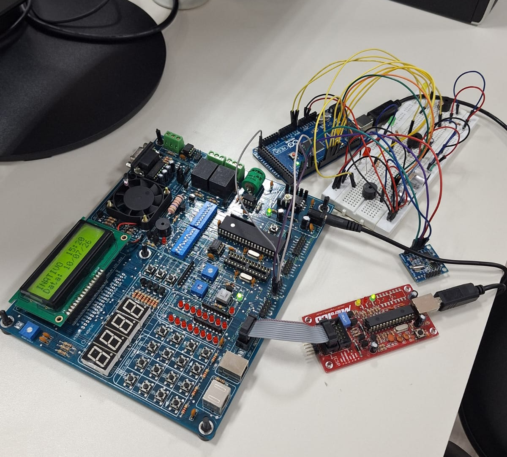

# PIC Monitor System

Embedded monitoring system developed for the Embedded Systems course in the Computer Engineering program at UNIFESP.

The project is built around two controllers working together:

- Arduino Mega 2560, responsible for sensor acquisition and local safety response.
- PIC18F4520, responsible for the remote supervision panel, user interface, and threshold configuration.

## Overview

The system monitors three physical variables in real time:

- temperature
- light intensity
- level or distance

When the system is unlocked with a password, the user gains access to a remote interface that allows them to:

- view live measurements;
- define operating thresholds for the sensors;
- turn the system on or off;
- trigger visual and audible alerts on the Arduino whenever a threshold is exceeded.

## Architecture

The project is divided into two main parts:

### Arduino Mega 2560 - sensing and local response

Responsible for:

- reading the HC-SR04 ultrasonic sensor;
- reading the LM35 temperature sensor;
- reading the LDR light sensor;
- receiving commands and thresholds via UART;
- driving alert LEDs and buzzers;
- logging events with date and time using a DS1307 RTC.

### PIC18F4520 - remote supervision panel

Responsible for:

- displaying the home screen with date, time, and system status;
- requesting a password to unlock the panel;
- presenting the monitoring menu;
- displaying measurements received from the Arduino in real time;
- adjusting sensor thresholds through the ADC and sending them over UART;
- operating the LCD, keypad, and communication link with the Arduino.

## Sensors and Actuators

### Sensors

- HC-SR04: distance or level measurement.
- LM35: temperature measurement.
- LDR: light intensity measurement.

### Actuators and indicators

- alert LEDs for each monitored variable;
- alert buzzers for each monitored variable;
- LCD on the PIC panel for local visualization.

## Arduino Pinout

The Arduino Mega 2560 pin assignments used in the project are:

| Function | Arduino Pin | Type |
| --- | --- | --- |
| HC-SR04 trigger | D12 | Digital output |
| HC-SR04 echo | D13 | Digital input |
| LM35 sensor | A0 | Analog input |
| LDR sensor | A1 | Analog input |
| LDR alert LED | D7 | Digital output |
| LM35 alert LED | D6 | Digital output |
| HC-SR04 alert LED | D5 | Digital output |
| HC-SR04 buzzer | D4 | Digital output |
| LDR buzzer | D3 | Digital output |
| LM35 buzzer | D2 | Digital output |

The Arduino also communicates with the PIC over UART and uses the DS1307 RTC through I2C for timestamped event logging.

## Features

- password authentication to access the system;
- system activation and deactivation;
- continuous reading of the three sensors;
- real-time value display on the PIC LCD;
- configuration of minimum and maximum operating thresholds;
- alert generation when measured values exceed the configured thresholds;
- event logging with date and time on the Arduino.

## Communication Between Modules

Data exchange between the PIC and the Arduino is done through UART.

### PIC commands to the Arduino

- `T`: request temperature.
- `L`: request light intensity.
- `N`: request level or distance.
- `A`: set temperature threshold.
- `B`: set light threshold.
- `C`: set distance threshold.
- `X`: turn the system on.
- `x`: turn the system off.

### Arduino response

The Arduino responds with the requested value as plain text, terminated by a newline character, so the PIC can display the measurement on the LCD or store the received threshold.

## User Flow

The operating flow is:

1. The user accesses the PIC panel.
2. The system requests the unlock password.
3. After authentication, the user can choose between monitoring sensors or adjusting thresholds.
4. The PIC sends UART commands to the Arduino.
5. The Arduino returns measurements and triggers local alerts when necessary.

## Repository Structure

- `arduino/arduino_sensor_node.ino`: Arduino Mega 2560 firmware.
- `pic/pic_supervision_panel.c`: PIC18F4520 firmware.
- `media/bench.jpeg`: bench setup photo.

## Notes

- The project was developed for educational purposes and demonstrates the integration of sensor reading, human-machine interaction, and serial communication between microcontrollers.